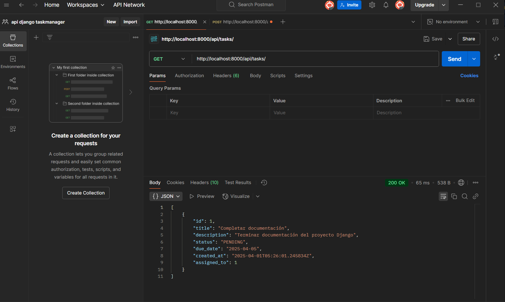
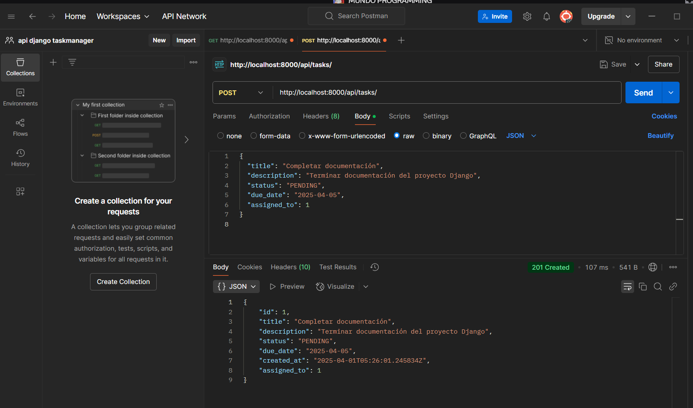

# 🧩 django-taskmanager-api — Backend RESTful para gestión de tareas con Django + JWT + Docker

## 🌍 Introducción

**django-taskmanager-api** es una API RESTful desarrollada con Django REST Framework que permite gestionar tareas de forma segura con autenticación JWT y control de permisos por usuario. Está completamente dockerizada, integra PostgreSQL como base de datos y es ideal como backend escalable para aplicaciones de productividad, SaaS o sistemas administrativos.

---

<details>
<summary>📘 English Documentation</summary>

## 📌 Description

This API provides endpoints to create, read, update and delete tasks. It uses Django REST Framework with JWT authentication, PostgreSQL for data persistence, and is fully containerized with Docker and docker-compose.

---

## 🛠️ Built With

- 🐍 Python 3.11.11
- 🌐 Django 5.1.7
- 🔧 Django REST Framework 3.15.2
- 🔐 JWT via `djangorestframework-simplejwt`
- 🛢️ PostgreSQL
- 🐳 Docker + docker-compose

---

## 📁 Project Structure

```sh
taskmanager/
├── backend/
│   ├── Dockerfile
│   ├── manage.py
│   ├── requirements.txt
│   ├── taskmanager/
│   │   ├── settings.py
│   │   ├── urls.py
│   └── tasks/
│       ├── models.py
│       ├── serializers.py
│       ├── views.py
│       ├── urls.py
├── docker-compose.yml
└── frontend/        # (empty for now – placeholder for future UI)
```


---

## 🚀 Getting Started

### 1. Clone the Repository

```bash
git clone https://github.com/camilotenorio1234/django-taskmanager-api.git
cd django-taskmanager-api
```

---

### 2. Start Services with Docker

```bash
docker-compose up --build
```

This will:

- Start PostgreSQL database
- Build and run the Django server at http://localhost:8000/

---

### 3. Apply Migrations & Create Superusers

In a new terminal, run:

``` bash
docker-compose exec web python manage.py makemigrations
docker-compose exec web python manage.py migrate
```

Then create superusers:

```bash
docker-compose exec web python manage.py createsuperuser
```

Example credentials:

- Username: admin
- Password: 1234


### 4. Access the Admin Panel

```bash
http://localhost:8000/admin/
```

--- 

### 🔐 JWT Authentication

#### Login & Refresh Endpoints

```sh
+------------------------+--------+--------------------------------------------+
| Endpoint               | Method | Description                                |
+------------------------+--------+--------------------------------------------+
| /api/token/            | POST   | Obtain access & refresh tokens             |
| /api/token/refresh/    | POST   | Refresh access token                       |
+------------------------+--------+--------------------------------------------+

```
--- 

Login with JSON body:

```json
{
  "username": "admin",
  "password": "1234"
}
```

Use the access token in your requests:

```sh
Authorization: Bearer your_access_token
```
---

### 📮 API Endpoints for Tasks

### 📮 API Endpoints for Tasks

```sh
+------------------------+--------+---------------------------+
| Endpoint               | Method | Description               |
+------------------------+--------+---------------------------+
| /api/tasks/            | GET    | List all tasks            |
| /api/tasks/            | POST   | Create a new task         |
| /api/tasks/{id}/       | GET    | Get task by ID            |
| /api/tasks/{id}/       | PUT    | Update full task          |
| /api/tasks/{id}/       | PATCH  | Update partial task       |
| /api/tasks/{id}/       | DELETE | Delete task               |
+------------------------+--------+---------------------------+

```

Example POST body:

```json
{
  "title": "Estudiar JWT",
  "description": "Aprender cómo funciona JWT en Django",
  "status": "PENDING",
  "due_date": "2025-04-10",
  "assigned_to": 1
}
```

> ⚠️ **Note:** `assigned_to` It must be the ID of an existing user.

---

### 🧪 Postman Testing

You can test endpoints easily with Postman:

- Use /api/token/ to obtain your JWT.
- Add Authorization: Bearer <access_token> in headers.
- Use CRUD endpoints under /api/tasks/.

---
### ⚙️ Tech Notes

- Authentication and permissions enforced with IsAuthenticated
- Full JWT config in settings.py
- Base image: python:3.11
- Uses Docker multi-service architecture (web + db)

---

### 📦 Requirements

See requirements.txt for exact dependency versions:

```sh
asgiref==3.8.1
Django==5.1.7
djangorestframework==3.15.2
djangorestframework_simplejwt==5.5.0
dnspython==2.7.0
mysqlclient==2.2.7
pip==25.0
psycopg2-binary==2.9.10
PyJWT==2.9.0
pymongo==4.11.3
setuptools==75.8.0
sqlparse==0.5.3
tzdata==2025.1
wheel==0.45.1
```
---

## 📸 Postman Testing

### 🔍 Task Retrieval (GET)



### ✍️ Task Creation (POST)




</details>

<details>
<summary>📘 Documentación en Español</summary>

# 🧩 django-taskmanager-api — Backend RESTful para gestión de tareas con Django + JWT + Docker

## 🌍 Introducción

**django-taskmanager-api** es una API RESTful desarrollada con Django REST Framework que permite gestionar tareas de forma segura con autenticación JWT y control de permisos por usuario. Está completamente dockerizada, integra PostgreSQL como base de datos y es ideal como backend escalable para aplicaciones de productividad, SaaS o sistemas administrativos.

---

## 📌 Descripción

Esta API proporciona endpoints para crear, leer, actualizar y eliminar tareas. Utiliza Django REST Framework con autenticación JWT, PostgreSQL para la persistencia de datos y está completamente contenerizada con Docker y docker-compose.

---

## 🛠️ Tecnologías Utilizadas

- 🐍 Python 3.11.11
- 🌐 Django 5.1.7
- 🔧 Django REST Framework 3.15.2
- 🔐 JWT con `djangorestframework-simplejwt`
- 🛢️ PostgreSQL
- 🐳 Docker + docker-compose

---

## 📁 Estructura del Proyecto

```sh
taskmanager/
├── backend/
│   ├── Dockerfile
│   ├── manage.py
│   ├── requirements.txt
│   ├── taskmanager/
│   │   ├── settings.py
│   │   ├── urls.py
│   └── tasks/
│       ├── models.py
│       ├── serializers.py
│       ├── views.py
│       ├── urls.py
├── docker-compose.yml
└── frontend/        # (aún vacío – para UI futura)

```
---

### 🚀 Primeros Pasos

#### 1. Clona el repositorio
```bash
git clone https://github.com/camilotenorio1234/django-taskmanager-api.git
cd django-taskmanager-api
```
---

#### 2. Inicia los servicios con Docker

```bash
docker-compose up --build

```

---

#### Esto iniciará:

- La base de datos PostgreSQL
- El servidor Django en: http://localhost:8000/

---

#### 3. Aplica migraciones y crea superusuarios

En una nueva terminal, ejecuta:

```bash
docker-compose exec web python manage.py makemigrations
docker-compose exec web python manage.py migrate
```

Luego crea un superusuario:

```bash
docker-compose exec web python manage.py createsuperuser
```

Credenciales de ejemplo:
- Usuario: admin
- Contraseña: 1234

---

#### 4. Accede al panel de administración

```bash
http://localhost:8000/admin/
```
---

### 🔐 Autenticación JWT

Endpoints para login y refrescar tokens

```sh

+------------------------+--------+--------------------------------------------+
| Endpoint               | Método | Descripción                                |
+------------------------+--------+--------------------------------------------+
| /api/token/            | POST   | Obtener tokens de acceso y refresh         |
| /api/token/refresh/    | POST   | Refrescar el token de acceso               |
+------------------------+--------+--------------------------------------------+
```

Inicia sesión con un cuerpo JSON:

```json
{
  "username": "admin",
  "password": "1234"
}
```

Utiliza el token de acceso en tus solicitudes:

```sh
Authorization: Bearer tu_token_de_acceso
```

---

### 📮 Endpoints de la API de Tareas

```sh

+------------------------+--------+---------------------------+
| Endpoint               | Método | Descripción               |
+------------------------+--------+---------------------------+
| /api/tasks/            | GET    | Listar todas las tareas   |
| /api/tasks/            | POST   | Crear una nueva tarea     |
| /api/tasks/{id}/       | GET    | Obtener tarea por ID      |
| /api/tasks/{id}/       | PUT    | Actualizar tarea completa |
| /api/tasks/{id}/       | PATCH  | Actualizar tarea parcial  |
| /api/tasks/{id}/       | DELETE | Eliminar tarea            |
+------------------------+--------+---------------------------+
```

Ejemplo de cuerpo para POST:

```json
{
  "title": "Estudiar JWT",
  "description": "Aprender cómo funciona JWT en Django",
  "status": "PENDING",
  "due_date": "2025-04-10",
  "assigned_to": 1
}
```

> ⚠️  Nota: `assigned_to` debe ser el ID de un usuario existente.

---

### 🧪 Pruebas con Postman
Puedes probar fácilmente los endpoints con Postman:

- Usa /api/token/ para obtener tu JWT
- Agrega Authorization: Bearer <token> en los headers
- Usa los endpoints CRUD bajo /api/tasks/

---

### ⚙️ Notas Técnicas

- Autenticación y permisos usando IsAuthenticated
- Configuración completa de JWT en settings.py
- magen base: python:3.11
- Arquitectura de múltiples servicios (web + base de datos) con Docker

---

### 📦 Requisitos

Mira el archivo requirements.txt para las versiones exactas:

```sh
asgiref==3.8.1
Django==5.1.7
djangorestframework==3.15.2
djangorestframework_simplejwt==5.5.0
dnspython==2.7.0
mysqlclient==2.2.7
pip==25.0
psycopg2-binary==2.9.10
PyJWT==2.9.0
pymongo==4.11.3
setuptools==75.8.0
sqlparse==0.5.3
tzdata==2025.1
wheel==0.45.1
```

---

## 📸 Pruebas en Postman

### 🔍 Consulta de tareas (GET)


### ✍️ Creación de tarea (POST)


</details>
